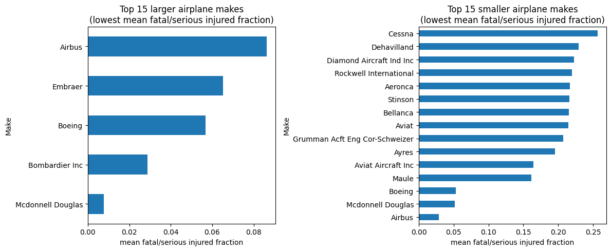
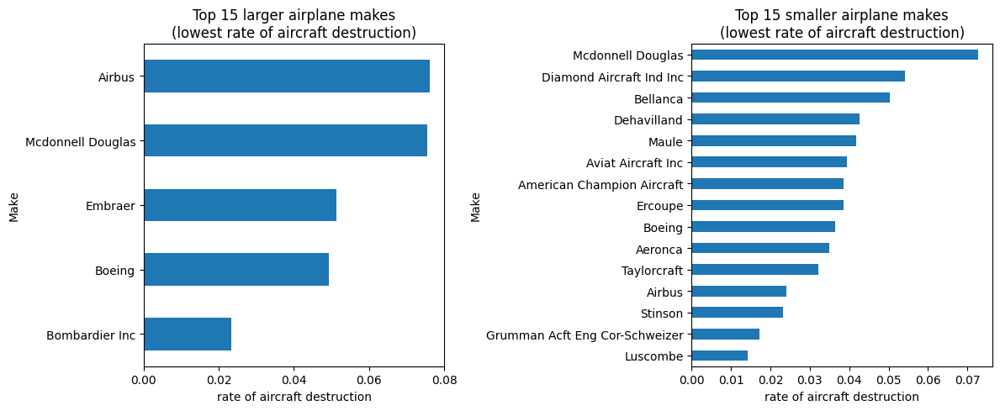
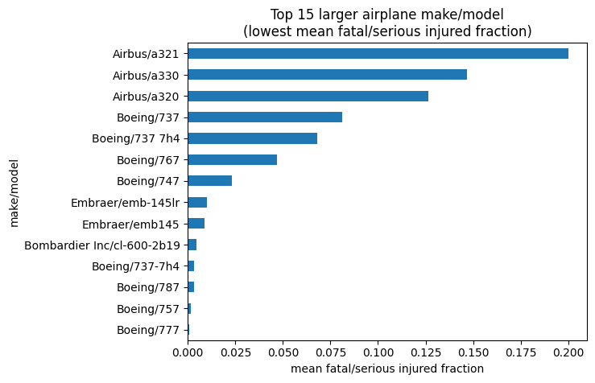
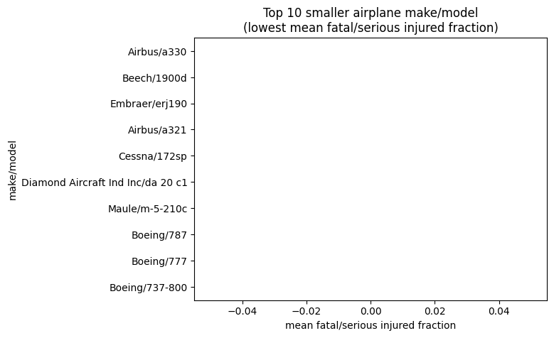
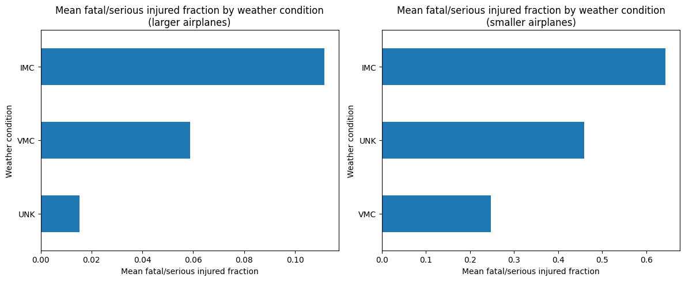
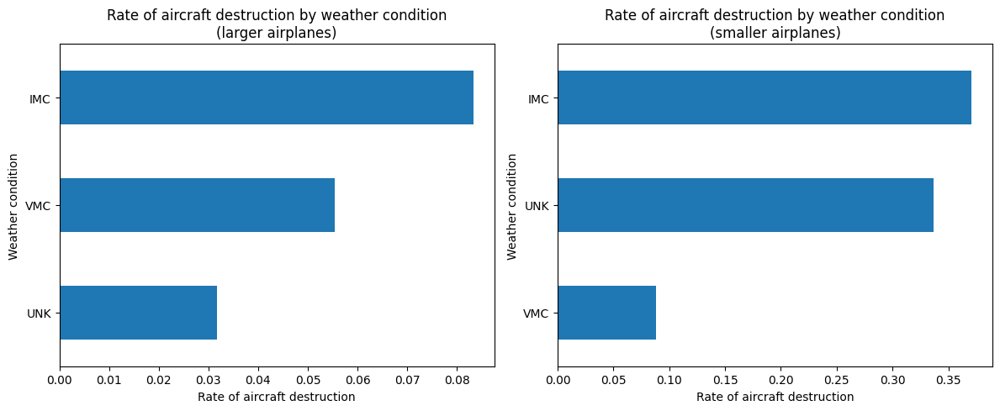
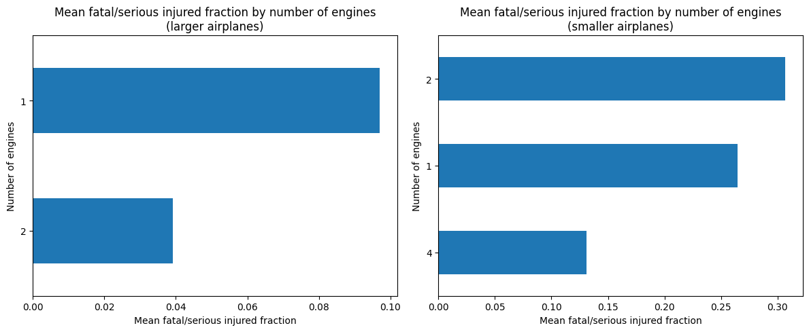
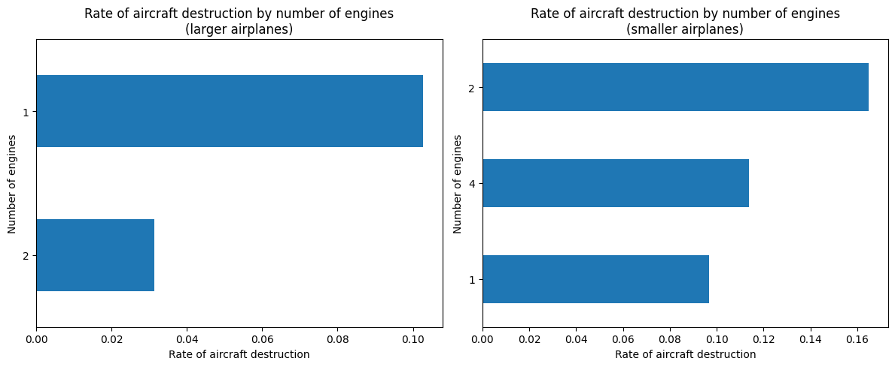

# Aviation Accident Analysis
## Data
My analysis was done using the AviationData_clean.csv located in the data directory.

## Anaylsis for Make

For smaller airplanes, Airbus is the only airplane make in the top 5 lowest for the both the rate of aircraft destruction at about 0.02 and the mean fatal/serious injured fraction at about 0.03. I recommend Airbus as the make to use for smaller airplanes.

For larger airplanes, Bombardier Inc is the only airplane make in the top 2 for the lowest rate of aircraft destruction at about 0.02 and the second lowest mean fatal/serious injured fraction at about 0.03. I recommend Bombardier as the make to use for larger airplanes.

Note: My analysis was done with a sample size of at least 30 for each combination of values for airplae make and smaller/bigger airplane type.

## Analysis for Make/Model

For larger airplanes:
  - None of the airplane types in the top 15 lowest mean fatal/serious injured fraction exceed 0.2.
  - More than half of the airplane types in the top 15 lowest mean fatal/serious injured fraction came from Boeing.
  - 80% of the airplane types in the top 5 lowest mean fatal/serious injured fraction came from Boeing.
  - I recommend the Boeing/777, Boeing/757, and Boeing/787 make/model because are the top three lowest for the mean fatal/serious fraction with about 0.001, 0.001, and 0.003, respectively. I rounded to the nearest thousandths.

For smaller airplanes
  - All the airplane types in top 10 lowest mean fatal/serious injured fraction had their values as 0, so there were no fatal/serious injuries for their accidents, and Boeing/777 and Boeing/787 are among these 10.
  - I recommend any of these 10 because they had no fatal/serious injuries.

If I had to recommend two specific make/models that can be used for larger and smaller airplanes, I would go with Boeing/777 and Boeing/787 for reasons listed above.

Note: The sample size is at least 10 (based on the assignment's instructions) for each combination of values for airplane make/model and smaller/bigger airplane type.

## Analysis for Weather Conditions

For larger airplane makes and weather conditions:
  - IMC has the highest rate of aircraft destruction (at about 0.08) and highest mean fatal/serious injured fraction (at about 0.11) among the weather conditions.
  - UNK has the lowest rate of aircraft destruction (at about 0.03) and lowest mean fatal/serious injured fraction (at about 0.02) among the weather conditions with at least 30 samples for larger airplanes
    - Note: Since UNK represents unknown weather conditions, I will focus on VMC, which had the next lowest rate of aircraft destruction (at about 0.06) and mean fatal/serious injured fraction (at about 0.06).

For smaller airplane makes and weather conditions:
  - IMC has the highest rate of aircraft destruction (at about 0.37) and highest mean fatal/serious injured fraction (at about 0.64) among the weather conditions.
  - VMC has the lowest rate of aircraft destruction (at about 0.09) and lowest mean fatal/serious injured fraction (at about 0.25) among the weather conditions with at least 30 samples for smaller airplanes.

Recommendation for airplanes based on weather conditions: For smaller airplanes, choose VMC over IMC because VMC has less than a fourth of the rate of aircraft destruction and has less than half the mean fatal/serious injured fraction compared to IMC. For larger airplanes, choose VMC over IMC because VMC has about three fourths of the rate of aircraft destruction and has almost half of the mean fatal/serious injured fraction compared to IMC. For both smaller and larger airplanes go with VMC and avoid IMC as much as possible.

Note: My analysis and recommendations are based on a sample size of at least 30 for each combination of values for weather conditions and smaller/bigger airplane type.

## Analysiss for Number of Engines

For larger airplane makes and number of engines:
  - One engines has the highest rate of aircraft destruction (at about 0.10) and highest mean fatal/serious injured fraction (at about 0.10) among the number of engines with at least 30 samples for larger airplanes.
  - Two engines has the lowest rate of aircraft destruction (at about 0.03) and lowest mean fatal/serious injured fraction (at about 0.04) among the number of engines with at least 30 samples for larger airplanes.

For smaller airplane makes and number of engines:
  - Two engines has the highest rate of aircraft destruction (at about 0.16) and highest mean fatal/serious injured fraction (at about 0.30) among the number of engines with at least 30 samples for smaller airplanes.
  - One engine has the lowest rate of aircraft destruction (at about 0.10) and is in the middle for the mean fatal/serious injured fraction (at about 0.26) among the number of engines with at least 30 samples for smaller airplanes.
  - Four engines is in the middle for the rate of aircraft destruction (at about 0.11) and has the lowest mean fatal/serious injured fraction (at about 0.13) among the number of engines with at least 30 samples for smaller airplanes.

Recommendation for airplanes based on number of engines: For smaller airplanes, choose four engines over two engines because four engines has a lower rate of aircraft destruction and mean fatal/serious injured fraction. The reason to choose four engines over one engine is because four engines reduces the mean fatal/serious injured fraction by about 51% compared to one engine while only increasing the rate of aircraft destruction by about 17% compared to one engine. However, if the rate of aircraft destruction is so much more important compared to the mean fatal/serious injured fraction, then it would be better to go with one engine. For larger airplanes, choose two engines over one engine because two engines has less than a third of the rate of aircraft destruction and and less than half of the mean fatal/serious injured fraction compared to one engine.

Note: My analysis and recommendations are based on a sample size of at least 30 for each combination of values for the number of engines and smaller/bigger airplane type.

